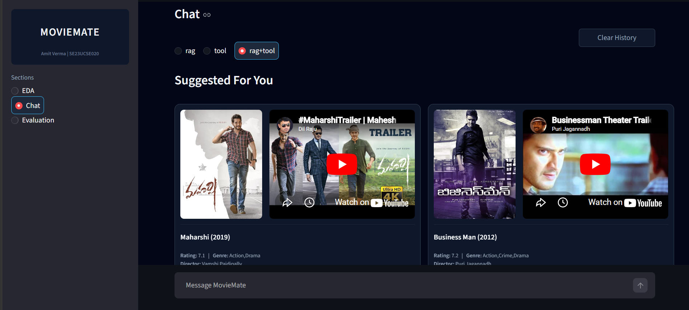
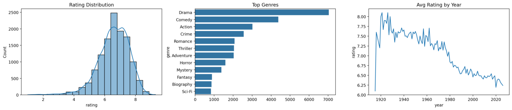
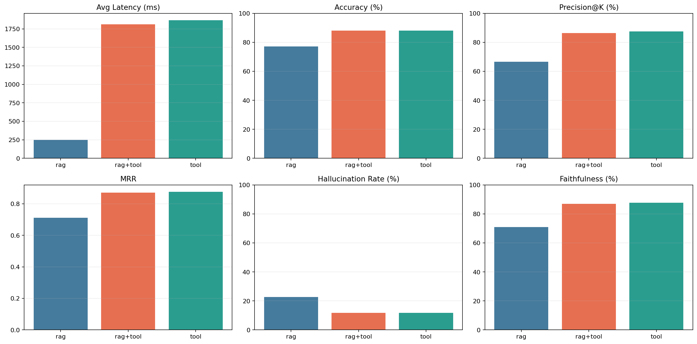
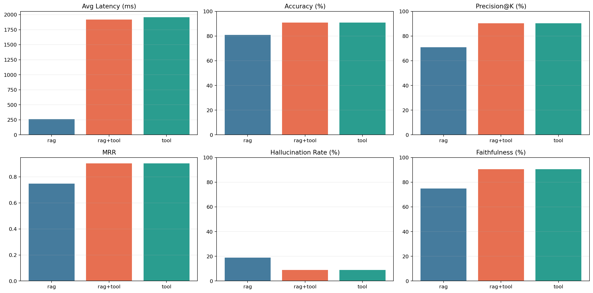

# MovieMate — Conversational Movie Search & Recommendations



MovieMate is a conversational movie search and recommendation system that combines semantic search (FAISS + embeddings) with a structured SQL layer for precise filtering. It supports natural language queries like “sci-fi movies after 2010” and intelligently routes them to either semantic retrieval, SQL queries, or both, depending on the query type.

## Project Contact
- **Author:** Amit Verma
- **Roll no.:** SE23UCSE020

## Key Features
- Natural language search over movie data using vector embeddings (FAISS) and microsoft/harrier-oss-v1-270m embedding model.
- SQL-based retrieval for strict filters like year, rating, duration, and director.
- Smart routing (`rag+tool`) that selects the best retrieval strategy based on query structure.
- Interactive Streamlit dashboard with chat, EDA, and evaluation tools.
- Built-in benchmarking system with detailed failure diagnostics.

## Project Structure (high level)
- `src/scrape.py` — data acquisition and enrichment (TMDB helpers).
- `src/preprocess.py` — metadata cleaning and normalization steps applied before embedding.
- `src/embed.py` — embedding generation and FAISS index build/update.
- `src/similarity_search.py` — vector retrieval helpers and ranking utilities.
- `src/tool_call.py` — SQL-based retriever and deterministic lookup interface.
- `src/agent.py` — retrieval orchestration, merge/re-rank logic, and prompt assembly for the LLM.
- `src/llm.py` — LLM client and prompt templates.
- `src/evaluation.py` — benchmark runner, metrics (precision@k, MRR, hallucination), and CSV diagnostics.
- `src/eda.py` — exploratory data analysis and plotting utilities used by the dashboard.
- `src/dashboard.py` — Streamlit app wiring chat UI, EDA view, and evaluation runner.
- `src/main.py` — CLI entrypoint exposing reproducible pipeline steps.

## Setup (quick)
1. Create and activate a Python virtual environment (recommended):

```powershell
uv init
uv venv
source .venv/bin/activate (Linux) or .\.venv\Scripts\Activate (Powershell)
```

2. Install dependencies using uv.
```powershell
uv sync
```

3. Place credentials in a `.env` file or environment variables:
- `LLM_BASE_URL` — base URL for your LLM/embedding API
- `LLM_API_KEY` — API key for LLM/embedding service
- `LLM_MODEL_NAME` — model identifier used by `src/llm.py`
- `TMDB_API_KEY` — optional TMDB key for `src/scrape.py`

## Common commands

Start the Streamlit dashboard (chat, EDA, evaluation):

```powershell
uv run moviemate
# or
uv run python -m src.main --step dashboard
```

Scrape movie metadata (TMDB key required):

```powershell
uv run python -m src.main --step scrape --tmdb_api_key YOUR_TMDB_KEY
```

Preprocess and normalize metadata:

```powershell
uv run python -m src.main --step preprocess
```

Build or update embeddings and FAISS index:

```powershell
uv run python -m src.main --step embed
```

Run EDA to regenerate plots and statistics:

```powershell
uv run python -m src.main --step eda
```

Quick similarity-search CLI test:

```powershell
uv run python -m src.main --step search --query "sci-fi movies after 2010"
```

Run the agent pipeline (hybrid RAG + tool):

```powershell
uv run python -m src.main --step agent --query "drama movies directed by Nolan"
```

Run evaluation benchmarks and export diagnostics:

```powershell
uv run python -m src.main --step eval
```

## EDA Plot



## EDA Statistics

Summary of key numeric features (computed from the movie table):

| rows  | rating  | year       | duration   |
|------:|--------:|-----------:|-----------:|
| count | 12325   | 12325      | 12325      |
| mean  | 6.5838  | 2003.2166  | 110.3784   |
| std   | 1.0138  | 18.9489    | 22.9102    |
| min   | 1       | 1915       | 45         |
| 25%   | 6       | 1995       | 95         |
| 50%   | 6.7     | 2008       | 106        |
| 75%   | 7.3     | 2017       | 120        |
| max   | 9.3     | 2026       | 566        |


### Evaluation
```bash
uv run python -m src.main --step eval
```

Evaluation prompt sources:
- `data/english_test_prompts.json`
- `data/hindi_test_prompts.json`

### Run EDA + Evaluation
```bash
uv run python -m src.main --step all
```

## Evaluation Outputs
Running `--step eval` now exports:
- `assets/benchmark_summary_hindi_english.csv`
- `assets/benchmark_detail_hindi_english.csv`
- `assets/failures_hindi_english.csv`
- `assets/benchmark_plot_hindi_english.png`
- `assets/benchmark_summary_english_only.csv`
- `assets/benchmark_detail_english_only.csv`
- `assets/failures_english_only.csv`
- `assets/benchmark_plot_english_only.png`
- `assets/eda.png`

## Hindi + English Metrics

- Best Accuracy: 88.18%
- Best Precision@K: 87.58%
- Best MRR: 0.8758
- Lowest Hallucination: 11.82%
- Best Tool Accuracy: 88.18%

| mode | avg_latency_ms | p95_latency_ms | avg_hits | accuracy_pct | precision_at_k | mrr | hallucination_rate | tool_call_accuracy | faithfulness_score |
|---|---:|---:|---:|---:|---:|---:|---:|---:|---:|
| rag | 249.42 | 316.33 | 2.65 | 77.27 | 66.67 | 0.7121 | 22.73 | 0.00 | 70.91 |
| rag+tool | 1811.91 | 1191.23 | 2.71 | 88.18 | 86.36 | 0.8712 | 11.82 | 80.00 | 87.09 |
| tool | 1865.62 | 1152.68 | 2.66 | 88.18 | 87.58 | 0.8758 | 11.82 | 88.18 | 87.82 |



## English-only Metrics

- Best Accuracy: 91.00%
- Best Precision@K: 90.33%
- Best MRR: 0.9033
- Lowest Hallucination: 9.00%
- Best Tool Accuracy: 91.00%

| mode | avg_latency_ms | p95_latency_ms | avg_hits | accuracy_pct | precision_at_k | mrr | hallucination_rate | tool_call_accuracy | faithfulness_score |
|---|---:|---:|---:|---:|---:|---:|---:|---:|---:|
| rag | 260.25 | 356.91 | 2.62 | 81.00 | 71.00 | 0.7483 | 19.00 | 0.00 | 75.00 |
| rag+tool | 1918.54 | 1081.38 | 2.68 | 91.00 | 90.33 | 0.9033 | 9.00 | 85.00 | 90.60 |
| tool | 1956.79 | 1227.46 | 2.66 | 91.00 | 90.33 | 0.9033 | 9.00 | 91.00 | 90.60 |



## Reflection

This project highlights the trade-offs between semantic retrieval (RAG) and structured querying (SQL tools) in real-world systems.

The hybrid routing approach performed best overall, but only after fixing retrieval noise, limiting top-k results, and improving tool parsing reliability. findings tied to the code, data, and evaluation artifacts in this repository.

### Summary
- Hybrid retrieval (semantic + SQL): experiments reported in the Evaluation outputs show `rag+tool` yields the best accuracy for bilingual benchmarks (88.18%) and English-only runs (91.00%).
- Constraint grounding: the deterministic SQL retriever in `src/tool_call.py` reliably enforces strict filters (year, duration, director), reducing hallucinations in constraint-heavy prompts; failure analysis for these cases lives in `assets/failures_*.csv`.
- Preprocessing impact: changes in `src/preprocess.py` (genre canonicalization, cast normalization, duration parsing) produced measurable ranking improvements during local experiments — re-run `uv run python -m src.main --step preprocess` before rebuilding embeddings.
- Indexing and reproducibility: FAISS indices are stored in local data (see `local/data/movies.faiss` and `data/movies.faiss`). Index/model alignment is essential: whenever `src/embed.py` changes the embedding model or tokenizer, rebuild the FAISS index and re-run evaluation.

### Limitations
- Sparse plot text: many records lack rich plot summaries, which limited semantic recall for plot-based queries. Adding plot-level text to the table would improve nearest-neighbor matches.
- Index lifecycle: index rebuilds are slow and currently manual; we need versioned index snapshots plus metadata (embedding model name) to avoid mismatches. See `src/embed.py` for the current build script.
- Latency & cost: `rag+tool` mode reduces hallucination but increases end-to-end latency (see latency columns in the metrics tables). For deployment, consider caching or async tool calls.

### Future Improvements
- Add plot-summary embeddings: update `src/preprocess.py` to include `plot` in the embedding text, then update `src/embed.py` to regenerate vectors and `local/data/movies.faiss`.
- Session personalization: add a short session context buffer in `src/agent.py` and a small weight to bias retrievals toward recent user interactions.
- Index/version metadata: extend `src/embed.py` to write an index metadata JSON (embedding model, timestamp, dataset hash) next to FAISS files and enforce checks in `src/similarity_search.py`.
- Human evaluation: curate a small set of ambiguous queries from `data/english_test_prompts.json` and `data/hindi_test_prompts.json` for human rating; store results under `assets/` for longitudinal analysis.

## Notes
- If dashboard starts in browser directly, use `uv run moviemate`.
- If models/index changed significantly, rerun `preprocess` + `embed` before evaluation.
